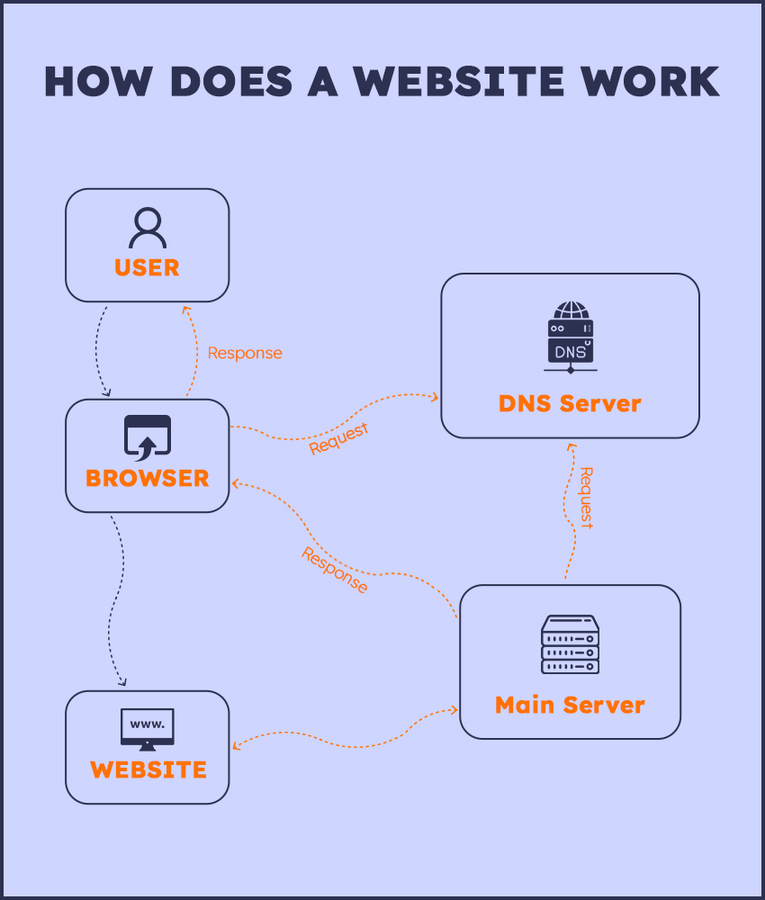

# How does a website work

>```Well, the most common definition of a website is ‘its a collection of webpages’. But what are web pages? Do you think it’s >too technical knowledge? Well, don’t worry, here we have simplified the whole process for your better understanding. So adjust >your seat, make it comfortable and here we go…```

# What is a website ?

>```A website is like a book. And its pages are called ‘webpages’. Just like different books may have different numbers of pages, different websites also have different numbers of web pages. A website can have one or one thousand web pages. And just like different pages may have different text or pictures, different web pages also may have different text or pictures or videos or something else.```


# Web Host or Hosting Server

>```Every website that you see on the internet, exists on a physical computer somewhere. I know this might be quite shocking for those who had no idea about it, but it’s true. All the data of a website exists in physical computers. So, in order that a user can access a website anytime, it’s very necessary that these physical computers are always turned on with an active internet connection. ```

>```Now that’s not possible for us to store our website on our computer and having it always turned on with internet connection and it’s quite expensive too. That is why we hire a hosting service. A hosting service or company basically gives a place to your website to exist from where it can be accessed almost 24*7 and the hosting company charges an amount for it.```

So, if the internet is a whole world, a web host or hosting server is basically the area where your website lives.

>```Domain Name: Now we know that every website lives somewhere. But where and how to find it? That is where the ‘domain name’ comes in. Every website has an address in a coded form known as an IP address. Now it’s not possible for us to remember the IP address of each website. So, a domain name is basically a name kept by the website owner which when entered into the search bar, redirects us to the website address.```

>```For example, ‘amazon.com’ is the domain name for Amazon’s website. You have to register your domain name with a domain registrar and pay a significant amount to use that name.```

>```DNS Server: DNS stands for Domain Name System. DNS server actually converts the domain name entered by the user into the IP address of that site, so the machine can read it and it can direct you to the actual address of the website.```

# How does a website work?



# For more information read this blog: < https://academind.com/tutorials/how-the-web-works >